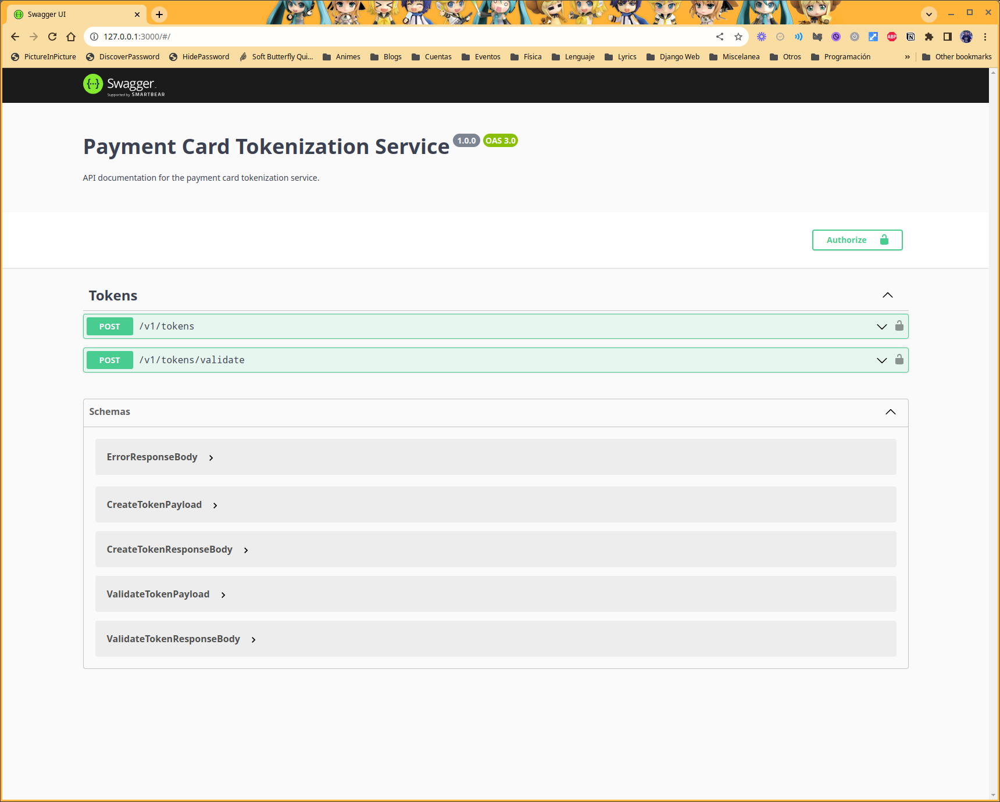
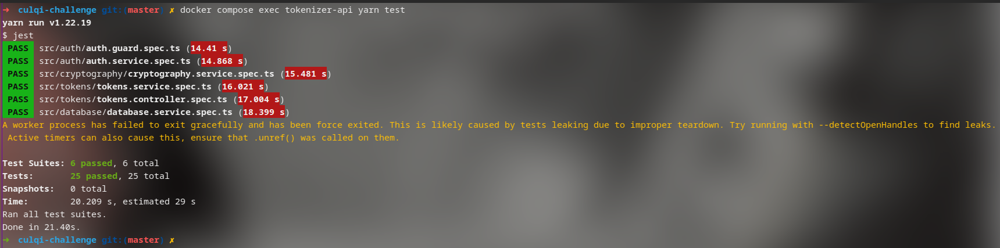
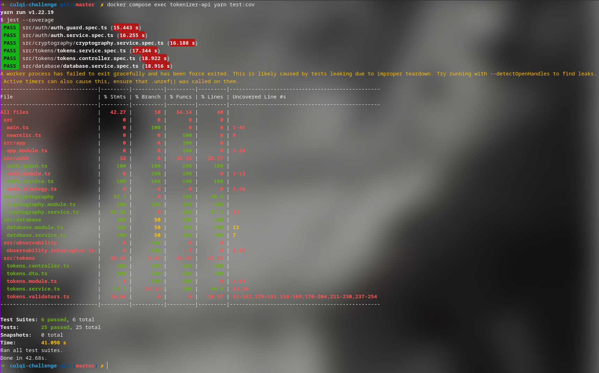
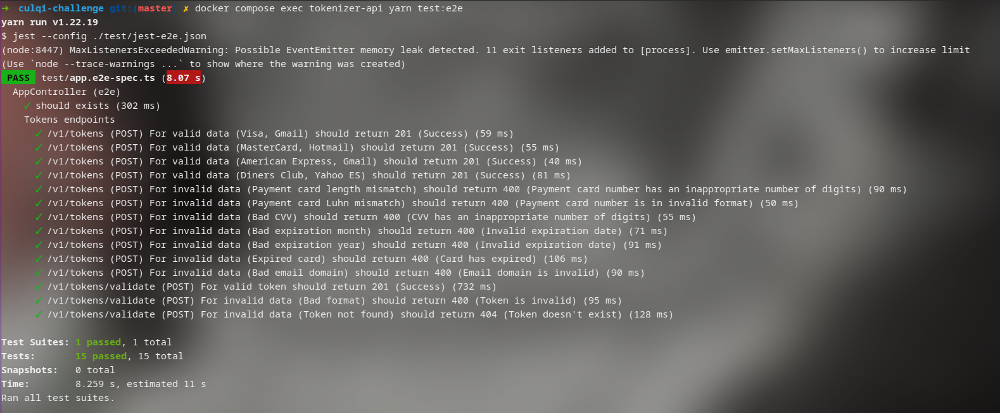

# Culqi Challenge: Tokenizer Service

## Requerimientos

Para la ejecución del proyecto en un entorno local se recomienda contar con las siguientes herramientas:

* [Docker](https://docs.docker.com/get-docker/)
* [Docker Compose](https://docs.docker.com/compose/install/)

El proyecto fue desarrollado con Node v18.17.1, yarn v1.22.19 empleando el framework [NestJS](https://nestjs.com/) y se encuentra dockerizado por lo que no es necesario instalar node ni yarn en el entorno local.

## Instalación

1. Dirigete a tu carpeta de trabajo y clona el repositorio

```bash
git clone git@github.com:zodiacfireworks/culqi-challenge.git
```

2. Ingresa a la carpeta del proyecto

```bash
cd culqi-challenge
```

3. Crea el archivo .env a partir del archivo .env.template

```bash
cp .env.template .env
```

Lee las instrucciones del archivo .env.template para configurar las variables de entorno de forma correcta.

4. Construye la imagen de docker

```bash
docker compose build
```

5. Levanta los contenedores de docker

```bash
docker compose up
```

6. Dirigete a la url http://127.0.0.1:3000 para acceder a la documentación de la API



## Ejecución de pruebas

1. Para ejecutar las pruebas unitaras se debe emplear el siguiente comando:

```bash
docker compose exec tokenizer-service yarn run test
```



1. Para ejecutar las pruebas con cobertura se debe emplear el siguiente comando:

```bash
docker compose exec tokenizer-service yarn run test:cov
```



3. Para ejecutar las pruebas de integración se debe emplear el siguiente comando:

```bash
docker compose exec tokenizer-service yarn run test:e2e
```



## Despliegue

Para el despliegue en producción es necesario contar con [kubeclt](https://kubernetes.io/es/docs/tasks/tools/install-kubectl/) y [eksctl](https://docs.aws.amazon.com/eks/latest/userguide/eksctl.html) instalados en el entorno local.

Para desplegar en un entorno de EKS se deben de seguir los siguientes pasos.

1. Debe de construir la imagen de docker y subirla a un repositorio de ECR

```bash
export DOCKER_IMAGE="${AWS_ACCOUNT_ID}.dkr.ecr.us-east-1.amazonaws.com/tokenizer-service:latest"

docker build -f Dockerfile -t "${DOCKER_IMAGE}" .
docker push "${DOCKER_IMAGE}"
```

2. Se debe de configurar el archivo `.env` en la capreta de `deployment`.

```bash
cp .env.template deployment/.env
```

Para este caso en particular el archivo debe de modificarse para incluir la palabra `export` antes de cada variable.

3. Ingresar a la carpeta de `deployment` y ejecutar el script `deploy.sh`

```bash
cd deployment
./deploy.sh
```

Esto desplegará un cluster de AKS en AWS y desplegará el servicio en el cluster.

### Observaciones:

Para este despliegue, si bien se completa hay dos actividades pendientes de documentación:

1. La creación automatica de AWS InMemory DB for Redis para el almacenamiento de los tokens.
2. La resolución de errores de permisos que han surgio en el despliegue.
